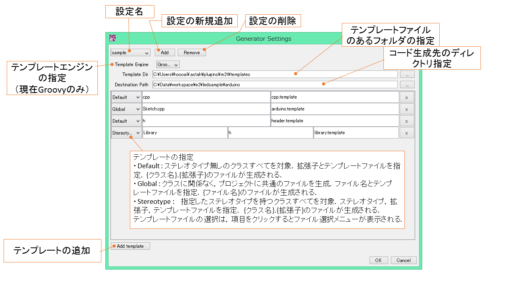

# astah m2t(Model to Text)

This is a code generator plug-in for Astah using Goovy's SimpleTemplate Engine.
There are three patterns to set the template per target models to generate the code of.

 - Default: Output configuration for classes which do not have stereotypes
 - Stereotype: Output configuration for models with specific stareotype
 - Global: General configuration for all the models in a whole project
 
## Installation
### How to install Plug-in
 - Download [Latest Release](https://github.com/s-hosoai/astahm2t/releases)
 - Help > Plug-in List
  + ＋Install
  + → Select the plug-in jar file
  + → Better if you install /astah-plugin-SDK-1.2/bundles/console-1.0.1.jar in the astah SDK folder
  
Restart Astah

### Configuration folders
Following directories would be created automatically at the installment of the plugin.

 - Windows
　C:/Users/{username}/.astah/plugins/m2t/
 - Mac
　~/.astah/plugins/m2t/

## How to use
Once the plug-in is installed successfully, new menu [m2t] is added under [Tool] menu.
[m2t] menu has [Generate] and [Setting] menu.

### Setting
Go to [Tool] - [m2t] - [Setting] to open the configuration window.

Please refer to [How to use m2t] on Astah.net (http://astah.net/features/m2t-plugin)

## How to create Template files
Template files need to be created by compyling with Groovy's SimpleTemplateEngine
[http://www.groovy-lang.org/templating.html#_simpletemplateengine](http://www.groovy-lang.org/templating.html#_simpletemplateengine)

The following variables are passed to the template files/

・u: Utility Class 

Utility Class can access the attributes. For example, if you want to create a class name, you can just do with  ${u.name} and java.template if you want to do Java-ish.

    public class ${u.name} {
    
    }

This will generate the class template.

### Access to variables
To expand the strings that are included in variables, you can access with ${Variable name}.
If there is a getter method, you can access by omitting get.
For example, if there is a "getName() method, you can access as name.

There is a Getter method for Utility Classes to access major model elements.
To access minor model elements, use iclass (Class Instance), api or projectAccessor.
[http://members.change-vision.com/javadoc/astah-api/6_9_0/api/en/doc/javadoc/index.html](http://members.change-vision.com/javadoc/astah-api/6_9_0/api/en/doc/javadoc/index.html)

To use iclass, refer to [IClass](http://members.change-vision.com/javadoc/astah-api/6_9_0/api/en/doc/javadoc/com/change_vision/jude/api/inf/model/IClass.html)
If you want to check if it is an abstract class or not and add the abstract keyword, the code will be like this below.

    public <% if(u.iclass.isAbstract)%> class ${u.name} {

### Control Statements

#### if
    <%if(condition)else%>

#### for
    <% for(variable in listVariable) %>

If you want to define the method,

Java Method sample

    <%for(method in u.iclass.operations) %>

### Helper Method
Strings between <% and %> would be recognized as Groovy scripts. So you can add helper methods like <% def func(param){} %>.
For example, you can code the sample above with abstract keyword, you can make it clean using the helper like this.

Abstract sample with helper

    <% def isAbstract(c){ if(c.isAbstract){return "abstract"} %>'''
    public ${isAbstract(u.iclass)} class ${u.name} {

## For Developers
This plug-in is developed using Xtend. Code in src/main/java are all the generated code.
To alter, modify the codes in src/main/xtend.
