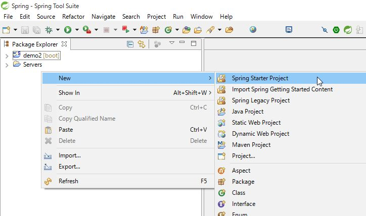
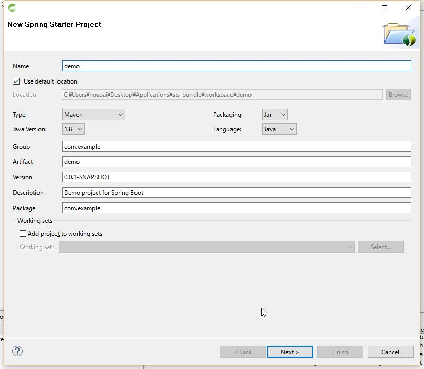
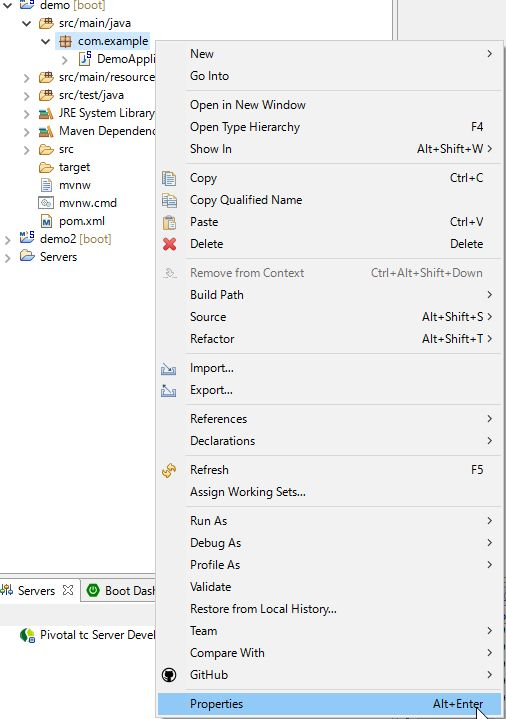
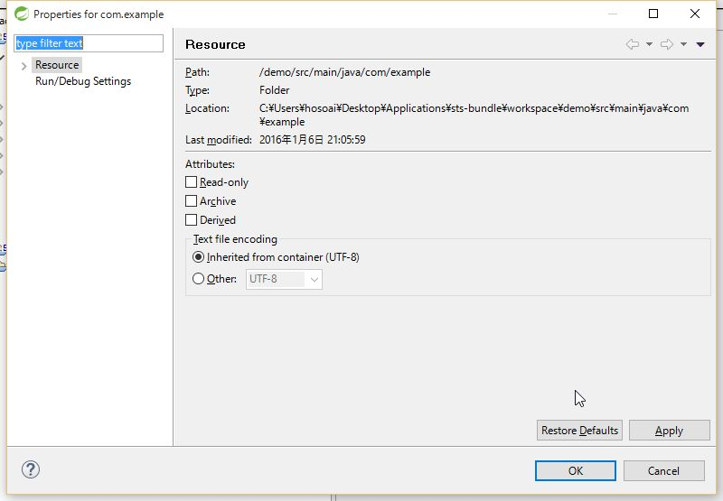
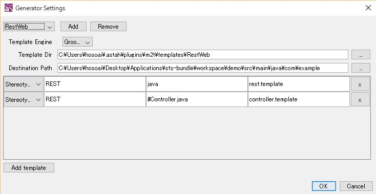
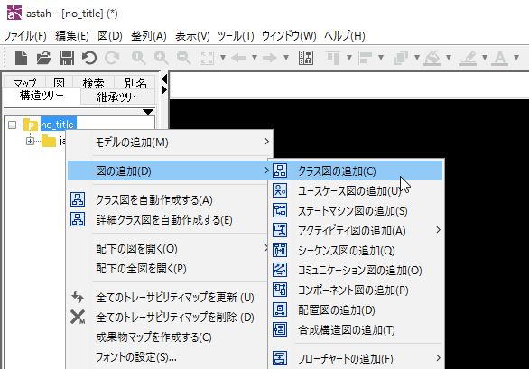
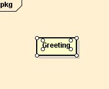
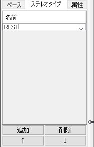
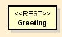
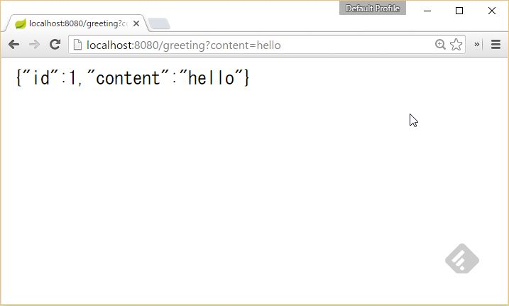

# astah m2t - Tutorial Spring Boot Rest WebService -
## 概要
astah m2tを使ってSpring Boot Getting Startの
[Building a RESTful Web Service](http://spring.io/guides/gs/rest-service/)を題材に，クラスか図からモデルやコントローラ，アプリケーションのクラスを生成するチュートリアルです．

## 手順
#### astah m2tのインストール
Readmeを参照ください

#### Spring Tool Suiteのインストール
下記URLより，環境に応じたSpring Tool Suite（以下STS)をDLして，解凍  
[Spring Tool Suite](https://spring.io/tools)

#### Spring Boot プロジェクトの作成
解凍したフォルダから，sts-bundle/sts-x.x.x.RELEASE/STS.exeをクリックしSTSを起動します．  
ひな形となるプロジェクトを作成します．  
File > New > Spring Starter Project と選択します．

プロジェクト名は適当なものを指定し，それ以外はデフォルトでNextへ進みます．

ツリーからWebを開き，Webにチェックを入れてFinishをクリックします．

プロジェクトが作成されるので，astah m2tからコードを生成する対象となる
フォルダのパスを調べておきます．  
demo / src/main/java / com.example を選択して右クリック>Propertiesを開きます．
Locationに表示されているパスをコピーしておきます．
  
  

#### astah m2t プロジェクトの作成
astahを起動し，新規プロジェクトを作成します．  
ツール > m2t > Settingsを開きます．  
左上のドロップダウンメニューでRestWebが選択されていることを確認します．
Destination Pathに先ほどコピーしたSpring BootのプロジェクトのLocationを貼り付けます．
その他はデフォルトで構いません．

#### クラス図の作成
クラス図を新規作成し，下記図のようなクラス図を作成します．

  
  
  
  

#### コード生成
ツール > m2t > Generateと選択します．先ほど指定したDestination Pathに
いくつかファイルが生成されます．

#### 生成コードの実行
STSに戻り，プロジェクトをリフレッシュします．
生成コードにエラーがないか確認し，実行します．

ブラウザで次のURLを開きます．[http://localhost:8080/greeting?content=hello](http://localhost:8080/greeting?content=hello)

もう一つ作成したクラスのJSONも開いてみましょう．
[http://localhost:8080/user?name=astah&age=135](http://localhost:8080/user?name&age=135)

STSではホットデプロイができますので，実行したままいろいろとモデルを変えて再生成させてみてください．

##まとめ
Spring Bootのサンプルを参考に，astahのクラス図からモデル・コントローラを出力するサンプルを
みてきました．このように一つのドメインモデルから，複数の定型コードを出力する際に有用です．
一方，テンプレートを見て頂けると分かると思うのですが，idのオートインクリメントの部分など，少し複雑に
なってしまいます．また，packageの生成はクラス図の作成が煩雑になるため今回は決め打ちで作成しています．
一つのテンプレートで様々なパターンに対応しようとすると，複雑になってしまいます．
場合によってはステレオタイプを分けて，別途専用のテンプレートを作ってしまった方が管理しやすくなると思います．

コード生成は万能ではなく，テンプレートの作成には手間が掛かりますし，一回しか利用しないテンプレートに，
手動でコーディングするよりも工数をかけてしまっては本末転倒です．
自動化する箇所，バリエーションを持たせる箇所，手動で作成する箇所を見極め，効率よく自動化を導入できるよう
検討してみてください．